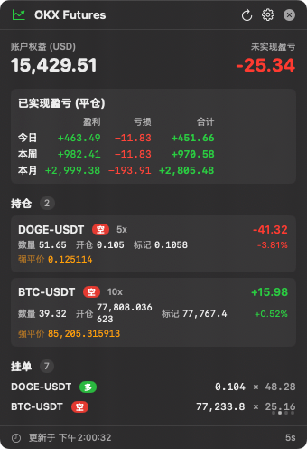

# OKX Monitor

> 常驻置顶的桌面悬浮挂件,只读监控 OKX 永续合约账户。
> An always-on-top desktop widget for monitoring your OKX perpetual-swap account (read-only).

<p align="center">
  
</p>

---

## 功能 · Features

| 中文 | English |
|---|---|
| 🪟 悬浮 `NSPanel`,永远置顶,跨桌面 / 全屏空间可见,可拖动 | Always-on-top `NSPanel`, visible across all Spaces & full-screen apps, draggable |
| 📊 账户权益 / 保证金率 / 未实现盈亏 实时刷新 | Live equity / margin ratio / unrealized PnL |
| 📈 已实现盈亏(平仓)按 GMT+8 **今日 / 本周 / 本月** 三档分桶,5 列展示:盈利 · 亏损 · 手续费 · 合计 | Realized PnL (closes) bucketed by GMT+8 **today / this week / this month**, 5-column grid: profit · loss · fees · net |
| 💰 显示账户 Maker/Taker 官方费率 + 本月实际有效费率 | Account Maker/Taker tier + month-to-date effective fee rate |
| 📋 持仓列表(方向/杠杆/数量/开仓价/标记价/uPnL/uPnL%/强平价) | Open positions: side / leverage / size / entry / mark / uPnL / uPnL% / liq price |
| 📑 挂单 2 行翻页轮播,自动 3D 翻页动画 | Pending-orders carousel (2 rows/page, auto-flipping) |
| 👀 自动关注列表:持仓∪挂单去重,显示 2h / 6h / 24h 涨跌,单行轮播 | Auto-derived watchlist (positions ∪ pending orders), 2h / 6h / 24h % change, single-row carousel |
| 🟰 菜单栏小图标 + 实时**未实现盈亏**数字,无需打开窗口就能看到盈亏 | Menu-bar status item showing **live uPnL** at a glance, no need to open the panel |
| 🔒 凭据存入 **macOS Keychain**,从不写入文件 / 注册表 / 命令行 | Credentials stored in **macOS Keychain**, never written to files / registry / argv |
| 🛡️ 只读 API:无法下单 / 撤单 / 提现 | Read-only API only — cannot trade, cancel, or withdraw |
| 🌐 API 域名可在 Settings 切换(`www.okx.cab` / `www.okx.com` / `aws.okx.com`),应对网络封锁 | API host switchable in Settings to bypass regional blocks |

---

## 快速开始 · Quick Start

```bash
git clone <repo-url>
cd okx-dashboard
./build.sh           # 编译 + 签名,产出 OKXMonitor.app
open OKXMonitor.app  # 启动
```

需要 Xcode Command Line Tools(自带 Swift 6)。
Requires Xcode Command Line Tools (ships with Swift 6).

**首次配置 · First-time setup:**
1. OKX 网站 → 个人中心 → API → 创建 API key,**权限仅勾选「读取」**
   On OKX: Profile → API → create a key with **READ permission only**
2. 启动 app,点小窗右上角 ⚙️ 填入 API Key / Secret / Passphrase
   Launch the app, click the ⚙️ icon, fill in API Key / Secret / Passphrase
3. 模拟盘账户:打开「模拟盘 (Demo Trading)」开关
   Demo accounts: toggle on **Demo Trading**

---

## 凭据存储 · Credential Storage

凭据通过 `Keychain.swift` 写入 **macOS 系统钥匙串**,服务名 `com.okxmonitor.credentials`,**仅当前用户可读**(由系统加密、按登录会话解锁)。

Credentials are stored in the **macOS Keychain** via `Keychain.swift` under the service name `com.okxmonitor.credentials`. They're encrypted by the OS, scoped to the current login session, and inaccessible to other users on the machine.

**App 从不**:
- 把凭据写入任何文件、`UserDefaults`、`NSPasteboard`
- 把凭据放进命令行参数、窗口标题、日志
- 通过 HTTP 发送(全部 HTTPS,且使用系统默认证书校验)

**The app never**:
- writes credentials to any file, `UserDefaults`, or the pasteboard
- puts credentials into command-line args, window titles, or logs
- sends them over plain HTTP (all HTTPS, default system cert validation)

如果你想删除,在「钥匙串访问」搜 `okxmonitor` 即可。
To wipe credentials, open **Keychain Access** and search `okxmonitor`.

---

## 菜单栏盈亏 · Menu-Bar Live PnL

App 在 macOS 顶部菜单栏注册一个状态项(图标:📈 趋势线),**实时显示账户当前未实现盈亏总额**:

- 盈利 → 绿色 `+123.45`
- 亏损 → 红色 `-67.89`
- 未配置 → 显示 ` OKX`
- 拉取失败 → 显示 ` --`(灰色)

点击图标弹出下拉菜单,显示账户权益、各持仓单独 PnL、挂单数 —— 不展开主窗口也能快速一瞥。

The app registers a status-bar item (📈 trend-line icon) that **live-displays your total unrealized PnL** even when the main panel is hidden. Clicking it drops down a summary menu with per-position breakdown, equity, and pending-order count — so you can glance without opening the floating widget.

详见 `Sources/OKXMonitor/AppDelegate.swift` 的 `setupStatusItem()` / `updateStatusTitle()`。
See `Sources/OKXMonitor/AppDelegate.swift` → `setupStatusItem()` / `updateStatusTitle()`.

---

## 数据来源 · Data Sources

所有 OKX v5 REST 接口,**全部 GET、全部签名**(`HMAC-SHA256(secret, timestamp+method+path)`)。
All OKX v5 REST endpoints, GET-only, HMAC-SHA256-signed.

| 用途 · Purpose | 接口 · Endpoint |
|---|---|
| 账户权益 · Equity | `/api/v5/account/balance` |
| 持仓 · Positions | `/api/v5/account/positions?instType=SWAP` |
| 挂单 · Pending orders | `/api/v5/trade/orders-pending` |
| 历史委托(实时,7 天) · Real-time history | `/api/v5/trade/orders-history` |
| 历史委托(归档,3 月) · Archived history | `/api/v5/trade/orders-history-archive` |
| 费率 · Fee tier | `/api/v5/account/trade-fee` |
| 合约面值 · Contract specs | `/api/v5/public/instruments` |
| K 线 · Candles (watchlist) | `/api/v5/market/candles?bar=1H` |

---

## 项目结构 · Project Layout

```
Sources/OKXMonitor/
  main.swift          入口 · entry point (accessory app, no Dock icon)
  AppDelegate.swift   悬浮窗 + 菜单栏 · floating panel + menu-bar status item
  ContentView.swift   主 UI · main UI
  SettingsView.swift  设置面板 · settings dialog
  Store.swift         状态 + 轮询 · state + polling timer
  OKXClient.swift     签名 REST 客户端 · signed REST client
  Keychain.swift      钥匙串凭据存储 · Keychain credential storage
  Models.swift        数据模型 · response models
  PlainField.swift    禁用智能引号的输入框 · text field with smart-quote substitution disabled

build.sh              编译 + 自签名 · build & self-sign
build-dmg.sh          打包 DMG · DMG packager
make-icon.sh          重新生成 AppIcon · regenerate AppIcon
docs/WINDOWS_PORT.md  Windows 版接手文档 · Windows port handoff doc
```

---

## TODO

- [ ] **Windows 版本** — `.NET 8 + WPF` 移植,详见 [`docs/WINDOWS_PORT.md`](docs/WINDOWS_PORT.md)
      **Windows port** — `.NET 8 + WPF`, see [`docs/WINDOWS_PORT.md`](docs/WINDOWS_PORT.md)
- [ ] **资金费纳入"合计"** — 当前已实现盈亏未计入永续资金费,需切换到 `/api/v5/account/positions-history` 的 `realizedPnl`(已含 fee + fundingFee)
      **Include funding fees** in net PnL — switch to `positions-history.realizedPnl` for fully-netted realized PnL
- [ ] **自动 host fallback** — 配置的域名失败时自动尝试备用,屏蔽 VPN/网络波动
      **Auto host fallback** — try alternate domains on connection failure, hiding VPN/network flapping
- [ ] **关注列表并发限流** — 当前每个 instId 一个 candles 请求,持仓 30+ 时需要 bounded concurrency
      **Bounded watchlist concurrency** — currently one candles request per instId; cap parallelism for accounts with many positions
- [ ] **盈亏 / 价格阈值通知** — 触达 ±X% 推送 macOS 通知
      **PnL / price alerts** — push macOS notifications on threshold crossings
- [ ] **历史曲线** — 24h / 7d 权益曲线小图
      **Equity sparkline** — small 24h / 7d equity chart
- [ ] **现货账户支持** — 当前仅 SWAP,扩展到 SPOT
      **Spot account support** — currently SWAP only, extend to SPOT
- [ ] **国际化** — UI 仍以中文为主,需要英文 strings 文件
      **Localization** — UI is mostly CN; needs an English strings file
- [ ] **单元测试** — 至少覆盖 OKX 签名、GMT+8 时间窗、PnL 桶聚合
      **Unit tests** — cover OKX signing, GMT+8 windowing, PnL bucketing

---

## 许可 · License

**[MIT](LICENSE)** — 自由使用、修改、再分发,仅需保留版权声明。
**[MIT](LICENSE)** — free to use, modify, and redistribute; just retain the copyright notice.

---

## 免责声明 · Disclaimer

本项目仅用于行情和账户监控,**只读、不下单**。请使用**仅勾选「读取」权限**的 API key。
作者不对因泄露 API 凭据、第三方接口变更、网络故障等导致的任何损失负责。

This tool is **read-only** and never places orders. Use API keys with **READ permission only**.
The author is not liable for any losses arising from credential leaks, upstream API changes, or network issues.
